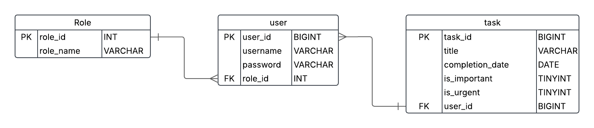
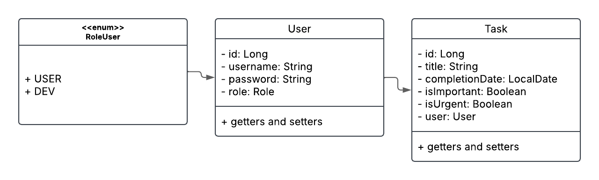

# Eisen's TODO


> O Eisen's TODO se trata de um gerenciador de tarefas simples com o 
diferencial de possuir nativamente uma classificação e ordenação com base na tabela de Eisenhower

### Diagramas
Abaixo estão os diagramas que modelaram o projeto:

#### Diagrama Entidade Relacionamento (DER)


#### Diagrama de Classes


### Ajustes e melhorias

O projeto ainda está em desenvolvimento e as próximas atualizações serão voltadas para as seguintes tarefas:

- [ ] Modelagem e Implementação do Banco de Dados
- [ ] Configuração Inicial da Aplicação
- [ ] Autenticação & Autorização
- [ ] Endpoints
- [ ] Swagger

## 💻 Pré-requisitos

Antes de começar, verifique se você atendeu aos seguintes requisitos:

- Você possui instalado as seguintes dependências:
  - Git
  - Docker
  - Postman / Insomnia
- Você tem uma máquina Linux, Windows (com WSL) ou MAC. Indique qual sistema operacional é compatível / não compatível.
- Você leu todo o README do projeto e o guia de instalação.

## 🚀 Instalando a API do Eisen's TODO

Para instalar o Eisen's TODO, siga estas etapas:

Abra um terminal no local que deseja e clone este projeto para sua máquina:
```
git clone https://github.com/calixtollucas/eisen-todo-api.git
```

Após clonado, abra um terminal dentro da pasta do projeto e execute a aplicação usando
```
docker compose up -d
```

## ☕ Usando Eisen's TODO

Para usar Eisen's TODO, siga estas etapas:

```
<exemplo_de_uso>
```

Adicione comandos de execução e exemplos que você acha que os usuários acharão úteis. Forneça uma referência de opções para pontos de bônus!